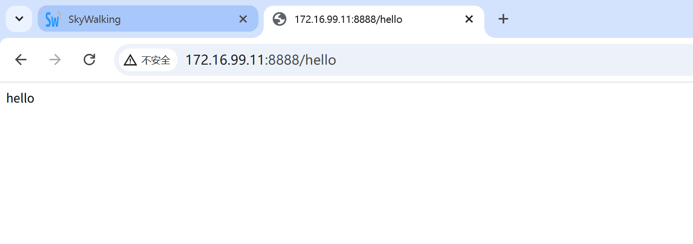
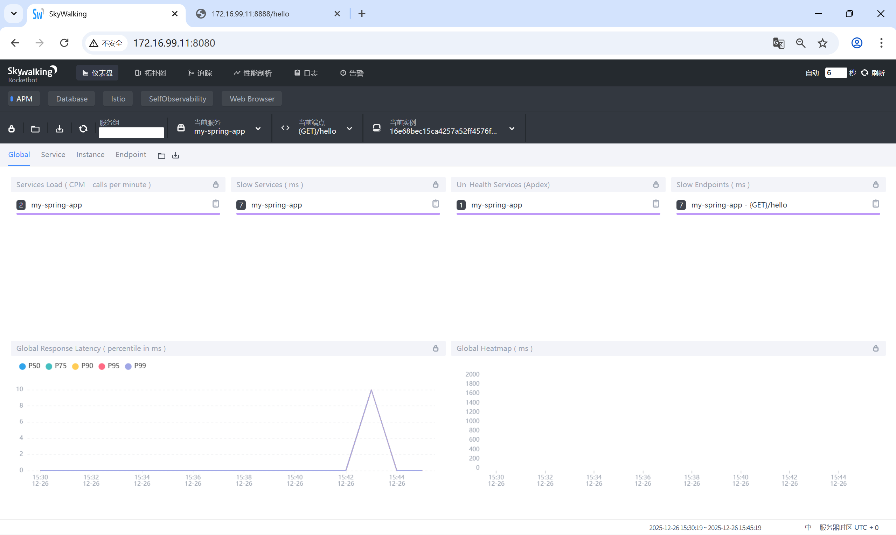
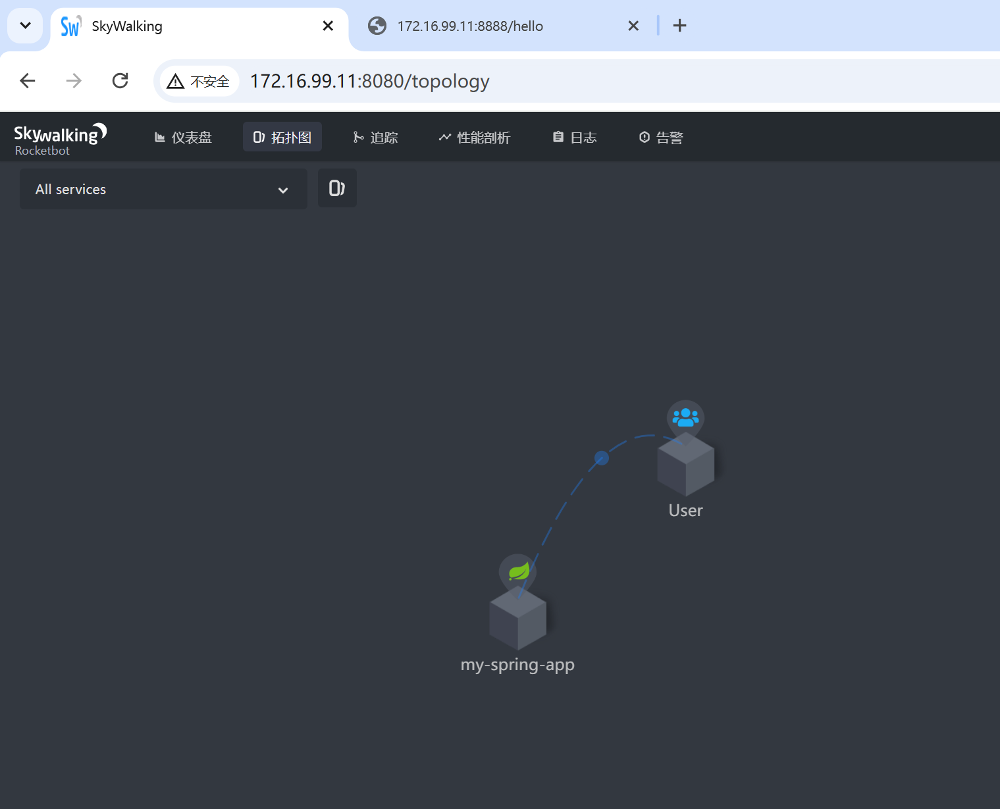

# spring-boot-skywalking-demo
> `官方文档 https://skywalking.apache.org/docs/main/latest/en/setup/backend/backend-docker/`
> 
> [](https://www.docker.com/)
> 
>  完整的Spring Boot应用集成SkyWalking APM监控解决方案
> 
> [](https://spring.io/)
> 
> [](https://skywalking.apache.org/)
>
> 
>
> 
>
> 

## 📋 项目简介

这是一个完整的Spring Boot应用监控示例，使用Apache SkyWalking进行应用性能管理和链路追踪。

### ✨ 特性
- 🚀 一键部署完整的SkyWalking监控环境
- 🔍 Spring Boot应用无缝集成SkyWalking探针
- 📊 可视化的应用性能监控和链路追踪
- 🐳 基于Docker Compose的容器化部署
- 📈 支持Elasticsearch作为存储后端

## 🏗️ 技术栈

| 技术 | 版本 | 说明 |
|------|------|------|
| Java | 1.8.0 | 运行环境 |
| Spring Boot | 2.7.0 | Web应用框架 |
| SkyWalking | 8.3.0 | APM监控系统 |
| Elasticsearch | 7.5.0 | 数据存储 |
| Docker | Latest | 容器化部署 |

## 🚀 快速开始

### 前置要求
- Docker 20.10+
- Docker Compose 2.0+
- Java 1.8+
- Maven 3.8+

### 1. 克隆项目
```bash
git clone https://github.com/baojingyiii/spring-boot-skywalking-demo.git
cd spring-boot-skywalking-demo

### 2. 部署SkyWalking监控系统
```bash
# 一键启动所有服务
docker compose up -d

# 查看服务状态
docker compose ps

# 访问SkyWalking UI
# 地址: http://localhost:8080
```

* docker-compose.yml
```yaml
# Licensed to the Apache Software Foundation (ASF) under one
# or more contributor license agreements.  See the NOTICE file
# distributed with this work for additional information
# regarding copyright ownership.  The ASF licenses this file
# to you under the Apache License, Version 2.0 (the
# "License"); you may not use this file except in compliance
# with the License.  You may obtain a copy of the License at
#
#     http://www.apache.org/licenses/LICENSE-2.0
#
# Unless required by applicable law or agreed to in writing, software
# distributed under the License is distributed on an "AS IS" BASIS,
# WITHOUT WARRANTIES OR CONDITIONS OF ANY KIND, either express or implied.
# See the License for the specific language governing permissions and
# limitations under the License.

version: '3.8'
services:
  elasticsearch:
    image: docker.elastic.co/elasticsearch/elasticsearch:7.5.0
    container_name: elasticsearch
    restart: always
    ports:
      - 9200:9200
    healthcheck:
      test: ["CMD-SHELL", "curl --silent --fail localhost:9200/_cluster/health || exit 1"]
      interval: 30s
      timeout: 10s
      retries: 3
      start_period: 40s
    environment:
      - discovery.type=single-node
      - bootstrap.memory_lock=true
      - "ES_JAVA_OPTS=-Xms512m -Xmx512m"
    ulimits:
      memlock:
        soft: -1
        hard: -1
  oap:
    image: apache/skywalking-oap-server:8.3.0-es7
    container_name: oap
    depends_on:
      - elasticsearch
    links:
      - elasticsearch
    restart: always
    ports:
      - 11800:11800
      - 12800:12800
    healthcheck:
      test: ["CMD-SHELL", "/skywalking/bin/swctl ch"]
      interval: 30s
      timeout: 10s
      retries: 3
      start_period: 40s
    environment:
      SW_STORAGE: elasticsearch7
      SW_STORAGE_ES_CLUSTER_NODES: elasticsearch:9200
      SW_HEALTH_CHECKER: default
      SW_TELEMETRY: prometheus
  ui:
    image: apache/skywalking-ui:8.3.0
    container_name: ui
    depends_on:
      - oap
    links:
      - oap
    restart: always
    ports:
      - 8080:8080
    environment:
      SW_OAP_ADDRESS: oap:12800
```
> 来源：https://github.com/apache/skywalking-docker/blob/master/archive/8/8.3.0/compose-es7/docker-compose.yml
>

#### my-spring-app
在本机启动app,以下为示例
```java
package com.baojingyi.prom.controller;

import org.springframework.web.bind.annotation.GetMapping;
import org.springframework.web.bind.annotation.RestController;

@RestController
public class HelloController {
    @GetMapping("/hello")
    public String Hello(){
        return "hello";

    }

}
```
```bash 
java -jar my-spring-app-1.0.0.jar    // 前台显示（测试应用是否可用）
```


### 3. 编译Spring Boot应用
> maven
```bash
# 1. 下载解压到用户目录
wget https://dlcdn.apache.org/maven/maven-3/3.8.9/binaries/apache-maven-3.8.9-bin.tar.gz
tar -zxvf apache-maven-3.8.9-bin.tar.gz
mv apache-maven-3.8.9 ~/maven-3.8.9

# 2. 只修改当前用户的环境变量
echo 'export PATH=~/maven-3.8.8/bin:$PATH' >> ~/.bashrc
source ~/.bashrc

# 3. 验证
mvn -v
```
> java 
```bash
yum install -y java-1.8.0-openjdk-devel
```

> 编译，生成my-spring-app-1.0.0.jar
```bash 
mvn clean package -DskipTests  // target目录下会生成jar包
```

### 启动应用并集成SkyWalking探针
```bash
nohup java -javaagent:skywalking-agent.jar -jar ../spring-boot-demo/target/my-spring-app-1.0.0.jar &    // jar包放置探针并启动
tail -f nohup.out   // 查看日志
```


注意修改agent

## 📁 项目结构

```
spring-boot-skywalking-demo/
├── spring-boot-demo/          # Spring Boot应用源码
│   ├── src/
│   ├── pom.xml
│   └── target/
├── agent/                     # SkyWalking Agent配置
│   ├── skywalking-agent.jar
│   └── config/
│       └── agent.config      # Agent配置文件
├── docker-compose.yml        # SkyWalking容器编排
├── dockerfile               # 应用Docker镜像
└── docs/                    # 文档和截图
    └── images/
        ├── skywalking-ui.png
        └── skywalking-topology.png
```

## 🔧 配置说明

### SkyWalking Agent配置

修改 `agent/config/agent.config`：

```properties
# 服务名称（在SkyWalking UI中显示）
agent.service_name=my-spring-app

# OAP服务器地址
# 注意：如果应用运行在宿主机，需要使用容器IP
collector.backend_service=172.26.0.3:11800  
         // 由于skywalking为容器，而my-spring-app在本机。使用docker-compose会自动产生network
         // docker network inspect spring-boot-skywalking-demo_default:查看oap的ip

# 获取容器IP的方法：
# docker network inspect spring-boot-skywalking-demo_default
```

